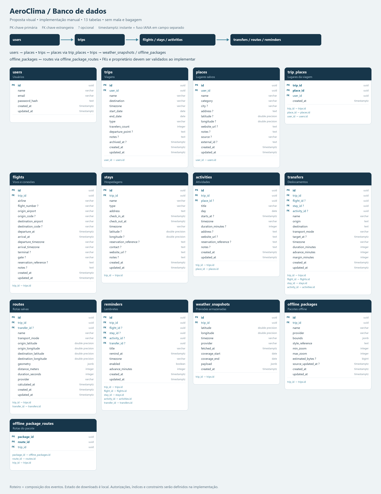

# Banco — proposta visual

Referência para vocês criarem as tabelas manualmente. Nenhuma tabela é criada automaticamente.

PK = chave primária; FK = chave estrangeira; ? = opcional. Campos são uma proposta inicial, sujeita a revisão.

- Users guarda apenas hash de senha; email deve ser único sem diferenciar maiúsculas.
- Trips pertence a um usuário. Voos, hospedagens, atividades, deslocamentos, rotas, lembretes, previsões e pacotes offline pertencem a uma viagem.
- Places pode existir sem viagem. Trip_places associa lugares e viagens do mesmo usuário.
- Atividades podem não ter horário. Roteiro é composto dos registros originais, sem duplicação de eventos.
- Instantes usam timestamptz e fusos IANA separados. Chegada, check-out e fim de viagem respeitam a ordem temporal.
- Deslocamentos e lembretes podem apontar para um único evento da mesma viagem. Saída é calculada dos dados atuais.
- Routes guarda geometria permitida pelo fornecedor. Offline_packages descreve cobertura e estilo. Estado de download fica no navegador/aparelho, sem status global de download no banco.
- Updated_at precisa ser atualizado pela aplicação ou trigger definida manualmente.

Sem mala/bagagens. Índices, constraints, autorização e regras de exclusão serão implementados e testados ao desenvolver cada módulo.
